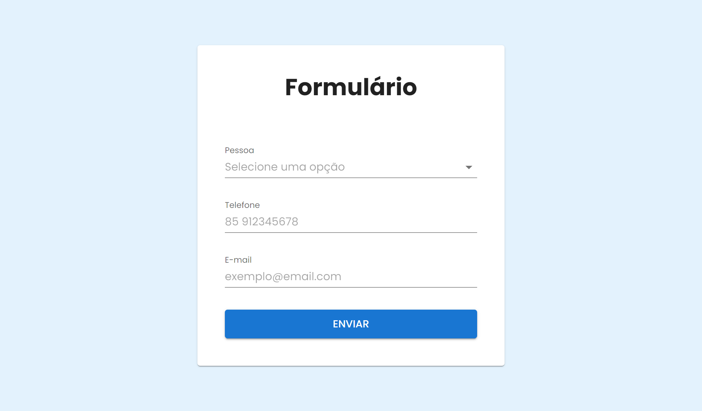

<h1 align="center">Polícia Civil Frontend Challenge</h1>

<details>
  <summary>Table of Contents</summary>
  <ol>
    <li>
      <a href="#about-the-challenge">About The Challenge</a>
      <ul>
        <li><a href="#requirements">Requirements</a></li>
      </ul>
    </li>
    <li>
      <a href="#technologies">Technologies</a>
    </li>
    <li><a href="#getting-started">Getting Started</a>
      <ul>
        <li><a href="#prerequisites">Prerequisites</a></li>
        <li><a href="#installation">Installation</a></li>
        <li><a href="#run-project-locally">Run Project Locally</a></li>
        <li><a href="#project-structure">Project Structure</a></li>
      </ul>
    </li>
    <li><a href="#author">Author</a></li>
    <li><a href="#license">License</a></li>
  </ol>
</details>

## About The Challenge



The challenge is to build a simple form using the `NextJS` framework, `MUI` (Material-UI) for UI components, and `react-hook-form` for form management. The form should have three fields: `person`, `phone`, and `email`, along with a submit button.

### Requirements
1. **Person Field:**  Implement a custom `Autocomplete` component for the `person` field. This component should utilize the `useFormContext` hook from the `react-hook-form` library. Options for the person field should [dynamically load  when the field is focused]((https://mui.com/material-ui/react-autocomplete/#load-on-open)).

2. **Form Submission:** Upon form submission, the data should be displayed in the console in the following JSON format:
When the form is submitted, it must be displayed the form data in the console as following:

    ```json
    {
      "pessoa": 1,
      "telefone": "85 98877665544",
      "email": "teste@email.com",
    }
    ```

3. **Option List:** Fetch the options for the person field from a JSON server. The structure of the options should be:

    ```json
    [
      {
        "id": 1,
        "nome": "Carlos Silva Lima"
      },
      {
        "id": 2,
        "nome": "Carlito Ramos Junior"
      },
      {
        "id": 3,
        "nome": "Paulo Felipe Castro"
      }
    ]
    ```
4. **Validation:** It's up to the developer to choose whether to use the `ZOD` library or any other library for form validation.

## Technologies
- [NextJS](https://nextjs.org/)
- [TypeScript](https://www.typescriptlang.org/)
- [MUI](https://mui.com/material-ui/)
- [JSON Server](https://github.com/typicode/json-server/)
- [React Hook Form](https://react-hook-form.com/)
- [Yup](https://github.com/jquense/yup/)

## Getting Started

### Prerequisites

- [Node.js](https://nodejs.org/en/)
- [Yarn](https://yarnpkg.com/)

### Installation
To download the project and install the its dependencies, do the following.

```bash
# Clone the project and access the folder
git clone https://github.com/carinebarros/policia-civil-challenge.git && cd policia-civil-challenge

# Install the dependencies
$ yarn
```

### Run Project Locally
Once the project is successfully installed, you can start the development server following the instructions bellow.

```bash

# Start the server
$ yarn server

# In another terminal, start the Frontend
$ yarn dev
```

**You'll be able to see the project at http://localhost:3000**

### Project Structure
```
/policia-civil-challenge
|-- src
|   |-- api
|   |-- app
|   |-- components
|   |-- styles
|   |-- utils
|-- theme.ts
|-- package.json
|-- README.md
```

- `api/`: Contains JSON file containing data and config to simulate an API;
- `app/`: Contains the page where the Form is used;
- `components/`: Contains React components such as the custom Autocomplete and the Form component;
- `styles/`: Contains files to style pages components;
- `utils/`: Contains various utility functions, constants, and regular expression patterns used across the project;
- `theme.ts`: File includes the custom configuration for the Material-UI theme.


## Author
This project was created by Carine Barros.

- GitHub: [/carinebarros](https://github.com/carinebarros)
- LinkedIn: [/in/carine-barros](https://www.linkedin.com/in/carine-barros/)
- Email: carinealzira@gmail.com

## License
[MIT](/license) © Carine Barros